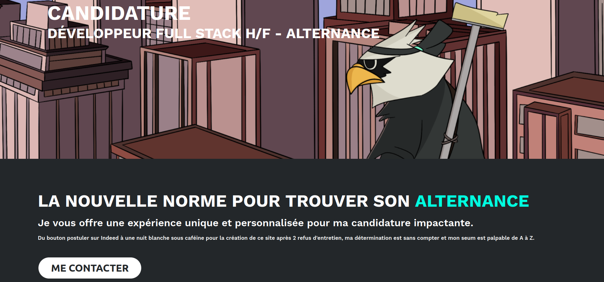

# Flying For You - Candidature Steven YAMBOS

Bienvenue sur ma réplique personnalisée de la page d'accueil de Flying For You, créée dans le cadre de ma candidature pour un poste de Développeur Full Stack en Alternance.

## Auteur

#### Steven YAMBOS
- [Portfolio](https://www.stevenyambos.fr/)
- [LinkedIn](https://www.linkedin.com/in/steven-yambos/)
- [Twitter](https://twitter.com/StevenYambos)

## Contexte

Je m'appelle Steven YAMBOS, étudiant en Développement Web en Master 1 à Paris. Cette réplique de la page d'accueil du site web de Flying For You est une démonstration de mes compétences en développement web, ainsi qu'une preuve de ma motivation à rejoindre l'équipe en tant que Développeur Full Stack en Alternance.

## Technologies Utilisées

- **Front-End** : ReactJS (Typescript), CSS
- **Back-End** : Ruby On Rails (je n'ai pas eu le temps de l'implémenter pour cette démonstration)

## Pages

- **Page d'accueil personnalisée** : Cette page d'accueil personnalisée remplace les informations de l'entreprise par les miennes, et elle est destinée à démontrer mon savoir-faire en matière de développement front-end.

## Déploiement

Cette application est actuellement déployée sur Vercel. Vous pouvez y accéder en suivant ce lien : [Flying For You - Candidature Steven YAMBOS](https://flying-for-you-candidature-steven-yambos.vercel.app/)

N'hésitez pas à me contacter si vous avez des questions ou si vous souhaitez discuter de ma candidature.

Merci de votre attention !
